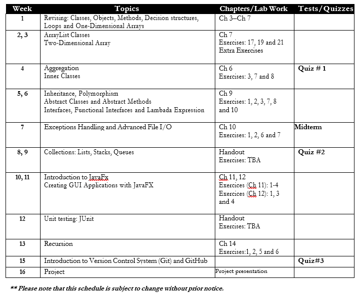

# OBJECT_ORIENTED_PROGRAMMING_CHAMPLAIN

Code samples from in class -- 
Grouped by Chapter: 

`Chapter 4`

# REVIEW
Includes review exercises done in the first week of class 

# CHAPTER 7 
Includes code done in the second and third week of class.

# CHAPTER 6
Includes code done in the fourth week of class

# CLASS SCHEDULE

